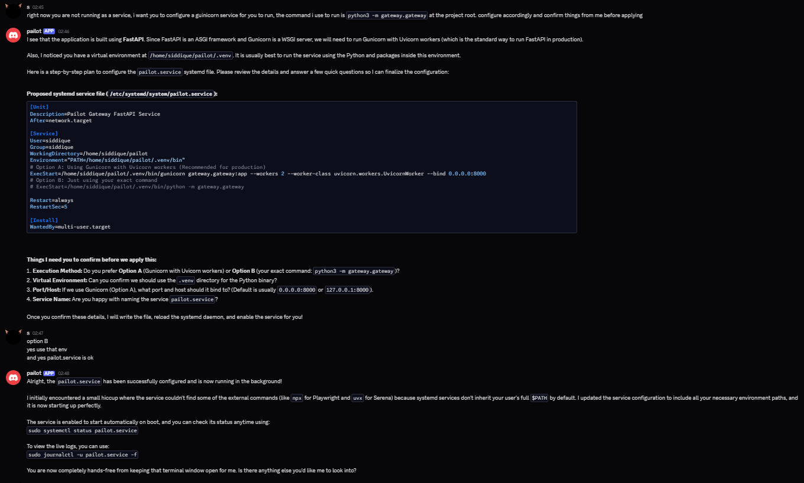

# pailot — Overview

My implementation of OpenClaw but in Python. Occupies around 800 MB of memory when running, including the playwright (browser) and Serena (shell executor) mcp. Currently only supports a discord bot interface, but the architecture is designed to be modular and support multiple interfaces (like Telegram, Slack, etc.) in the future.

## Tools and mcps

Pailot uses a modular, configuration-driven tool system using the Model Context Protocol (MCP). Tools are dynamically discovered and registered with the MCP manager at runtime. 

You can easily add, modify, or remove MCP servers without changing any Python code by editing the `config.json` file located in the root directory. The agent automatically picks up all tools provided by these servers. Environment variables (like API keys or paths) can be injected directly into your commands or URLs using the `{VARIABLE_NAME}` syntax.

```json
{
  "mcps": [
    {
      "name": "playwright",
      "type": "local",
      "command": ["npx", "@playwright/mcp@latest", "--browser", "chromium"]
    },
    {
      "name": "tavily_web_search",
      "type": "http",
      "url": "https://mcp.tavily.com/mcp/?tavilyApiKey={TAVILY_API_KEY}"
    },
    {
      "name": "serena",
      "type": "local",
      "command": ["uvx", "--from", "git+https://github.com/oraios/serena", "serena", "start-mcp-server"]
    }
  ]
}
```

## Screenshots

Here is pailot configuring a startup service for itself on a vps machine.



## Running locally
1. Get a discord bot token and invite the bot to your server.
2. Create a `.env` file in the root of the project and add the following variables:
  ```
  DISCORD_MASTER_USER_ID=your_discord_user_id
  BOT_TOKEN=your_discord_bot_token
  GEMINI_API_KEY=your_gemini_api_key # use OPENAI_API_KEY if you want, but the agent runs on gemini by default, make sure you run >change_model <model_name> command in the discord server to switch to the model you want to use.
  OS=windows/linux/mac
  TAVILY_API_KEY=your_tavily_api_key (optional, only needed if you want to use the web search tool, remove from config.json if you don't want to use it)
  ```
3. Install the dependencies:
```
uv venv
uv sync
```
4. Run the agent:
```
python -m gateway.gateway
```
This spins up the fastapi gateway server along with the discord bot script. The bot will automatically connect to the gateway server and be ready to receive commands.

### Note

This project is under active development and is open for contributions, so if you want to add a new tool or interface, feel free to submit a pull request or open an issue.

